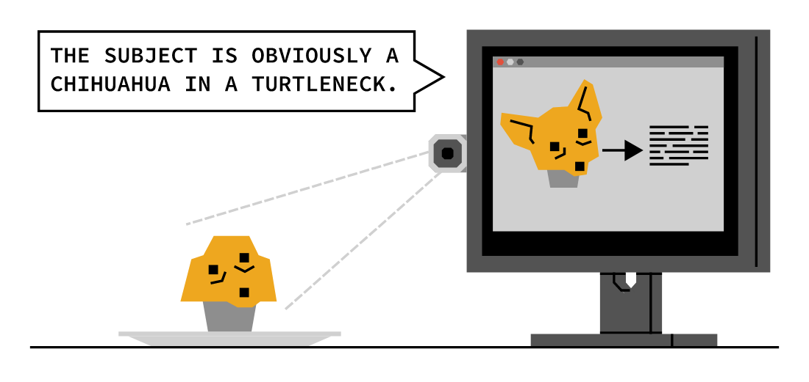

- A **decision tree** is a sequence of yes/no questions that help the computer decide what to output.
- Computers can make mistakes because they rely on decision trees designed with limited information.
  {:height 362, :width 747}
	- In this image recognition example, the decision tree is focusing on the placement of dark circles on a tan background. If the tree is calibrated to identify dog breeds, it may be fooled by a muffin.
	- Decision trees don’t “see” faces or dogs, they only consider features we instruct them to focus on.